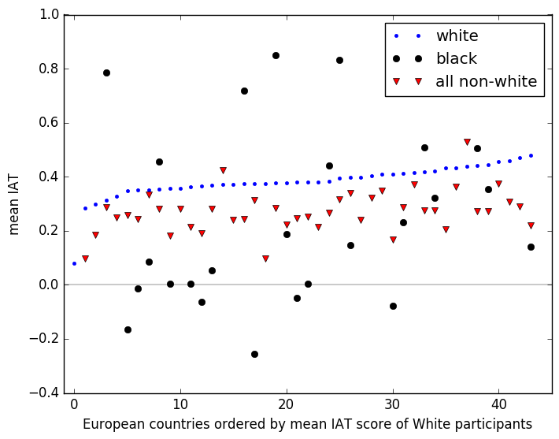

# average IAT scores across Europe by ethnicity

Following the publication of our [map](https://theconversation.com/this-map-shows-what-white-europeans-associate-with-race-and-it-makes-for-uncomfortable-reading-76661) of implicit associations about race of white Europeans from the [Project Implicit](https://implicit.harvard.edu/implicit/) online IAT, many people asked how the results would look for black Europeans. The data to answer this question has always been available, but I, finally, have got around to collating it into a readily grok-able form.

The main result from analysing the data of white Europeans was that - across every country - their implicit associations with blackness are negative (on average, they find it easier to associate white faces with positives words, and easier to association black faces with negative words). To see this, you can look at our version of the map which de-emphasises differences between countries and instead highlights the distance of the average scores from zero. White is neutral associations, red is positive associations about blackness and green is negative implicit associations about blackness:

There is no red or white.

Taking this same data, you can order the countries by smallest to largest, and plot each point to give a pleasing slope

Note
1. You can see clearly that the IAT scores are consistently above zero (zero represents neutral - neither positive nor negative average associations - and is shown on the graph with a horizontal line).
2. The country-identifying information is not shown. This is deliberate, because when we move to looking at the IAT scores of non-white Europeans the sample numbers aren't large enough to support drawing meaningful conclusions about individual countries.

First I looked at participants in the online IAT who identified as black, but the numbers were really low, often in single digits for some countries (just 632 in total, across all European countries, compared to 110,641 who identified as white). So, as an alternative, I also calculated the mean IAT for all participants who didn't identify as white (20,847 in all). Here's the result

I haven't plotted the confidence estimates around the mean values, since a) they would ruin the plot because they are so large and b) the individual values aren't interesting, but I think the overall pattern might be. (If you're the kind of person that likes to know error estimates then the data is [here](https://github.com/tomstafford/WorldBias/tree/master/Data)).

So, what can we see?
* All ethnicities, averaged across country, have (on average) negative implicit associations with blackness
* Implicit associations for whites look like they are stronger than for non-whites
* Average score for black participants are less than 0 in some countries, but that may just be because sample numbers are low enough (ie it is noise, not signal).
* Could it be that there is some country specific factor? ie IAT scores of non-whites slope upwards as white IAT scores do? 

For completeness, let's plot the normalised distributions of scores, for those three ethniticy categorised, aggegrating across countries:

Which roughly fits the US result, in that it puts the average IAT for black europeans close to zero (see Axt et al, 2014; Nosek et al, 2002). If anything the European sample mean is closer to positive associations with blackness than negative.

## Links

Read about our original map: 
This map shows what white [Europeans associate with race – and it makes for uncomfortable reading]
(https://theconversation.com/this-map-shows-what-white-europeans-associate-with-race-and-it-makes-for-uncomfortable-reading-76661)

More detail, other maps and further reading on the [figshare site](https://figshare.com/articles/European_map_of_Implicit_Racial_Bias/4750588)

Original analysis code and raw data is on [github](https://github.com/georgeg0/WorldBias). Code for this post here on my [fork](https://github.com/tomstafford/WorldBias) of George's repo

## References

Axt, J. R., Ebersole, C. R., & Nosek, B. A. (2014). The rules of implicit evaluation by race, religion, and age. Psychological Science, 25(9), 1804-1815.http://citeseerx.ist.psu.edu/viewdoc/download?doi=10.1.1.1010.98&rep=rep1&type=pdf

Nosek, B. A., Banaji, M., & Greenwald, A. G. (2002). Harvesting implicit group attitudes and beliefs from a demonstration web site. Group Dynamics: Theory, Research, and Practice, 6(1), 101.http://www.cos.gatech.edu/facultyres/Diversity_Studies/Nosek_HarvestingImplicit.pdf
